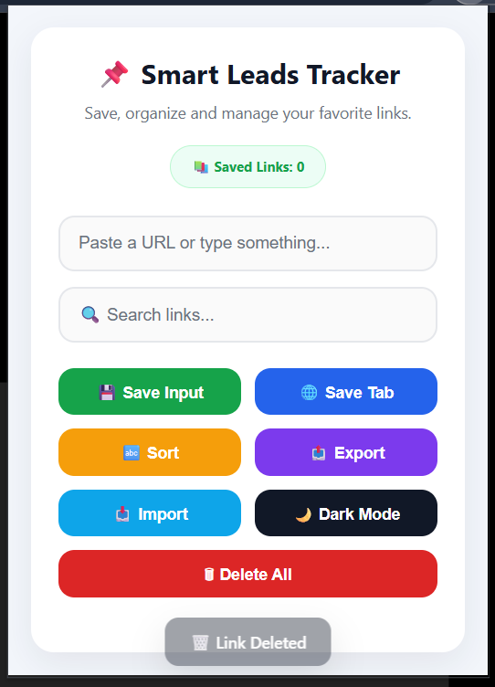
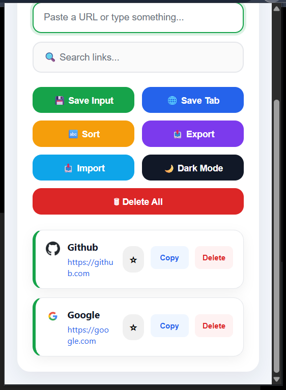
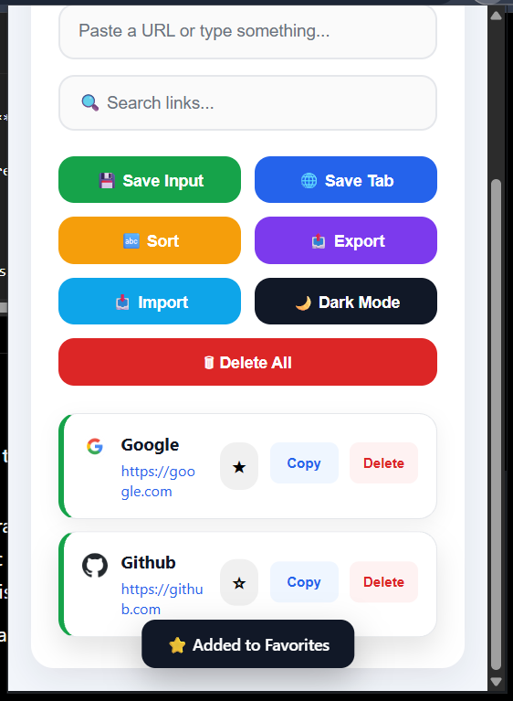

# 🚀 Smart Leads Tracker

> A modern, lightweight Chrome Extension to save, organize, and manage your favorite website links with a clean UI and powerful productivity features.


---

## 📖 Overview

Smart Leads Tracker is a productivity-focused Chrome Extension that helps users quickly save, search, organize, and manage important website links without leaving the browser.

Whether you're collecting study resources, project references, or useful websites, Smart Leads Tracker provides a fast and clutter-free experience.

---

## ✨ Features

- 🔗 Save website links manually
- 🌐 Save the currently active browser tab
- ⭐ Mark links as Favorites
- 🔍 Real-time search
- 📋 Copy links instantly
- 🗑️ Delete individual links
- 🧹 Delete all links
- 🔤 Sort links (A → Z / Z → A)
- 🌙 Dark & Light Theme
- 💾 Local Storage Persistence
- 📤 Export links to JSON
- 📥 Import links from JSON
- 🚫 Duplicate URL detection
- 📊 Saved links counter
- 🌍 Website favicons
- 📱 Responsive & modern UI

---

# 📸 Screenshots

## 🏠 Home



---

## 📚 Saved Links



---

## ⭐ Favorite Links



---

## 🛠️ Tech Stack

| Technology | Purpose |
|------------|---------|
| HTML5 | Structure |
| CSS3 | Styling |
| JavaScript (ES6+) | Functionality |
| Chrome Extension API | Browser Integration |
| Local Storage API | Data Persistence |

---

# 📂 Project Structure

```text
SMART-LEADS-TRACKER/
│
├── assets/
│   ├── icon.png
│   └── screenshots/
│       ├── home.png
│       └── saved-links.png
│
├── index.html
├── style.css
├── script.js
├── manifest.json
├── README.md
└── LICENSE
```

---

# 🚀 Installation

### 1. Clone the repository

```bash
git clone https://github.com/yourusername/smart-leads-tracker.git
```

### 2. Open Chrome

```
chrome://extensions
```

Enable:

```
Developer Mode
```

Click:

```
Load Unpacked
```

Select the project folder.

Done ✅

---

# 💡 How to Use

### Save a Link

Enter a URL and click **Save Input**.

---

### Save Current Tab

Click **Save Tab** to store the active webpage.

---

### Search

Use the search bar to instantly filter saved links.

---

### Favorite

Click the ⭐ icon to mark important links.

---

### Export

Export all saved links as a JSON file.

---

### Import

Import previously exported links with one click.

---

# 📦 Future Improvements

- ✏️ Edit Saved Links
- 🏷️ Categories / Tags
- ☁️ Cloud Sync
- 🔐 Chrome Storage Sync
- 📅 Recently Added Filter

---

# 🤝 Contributing

Contributions, issues, and feature requests are welcome.

Feel free to fork the repository and submit a Pull Request.

---

# 📄 License

This project is licensed under the MIT License.

---

# 👨‍💻 Author

**Theerthananda**

GitHub: https://github.com/theerthananda

---

## ⭐ Support

If you found this project useful, consider giving it a **Star ⭐** on GitHub.

It helps others discover the project and motivates future improvements.

---

Made with ❤️ using HTML, CSS, JavaScript & Chrome Extension APIs.